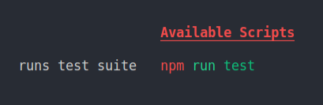

# `pjh` - Package.json Help

Extremely lightweight (`index.js` is 1.21 kb, 680 bytes gzipped) utility to generate help documentation for your `package.json` scripts.

# Usage

## Running `pjh`

```sh
npx pjh
```

Or with a help script (`"help": "npx pjh"`) setup:

```js
npm run help
```

Example output:


`package.json` for the example:

```json
{
	...
	"scripts": {
		"start": "node dist/index.js #pjh starts the (built) application",
		"setup": "npm i && cd client && npm i && cd .. #pjh todo: document script",
		"build": "npm run build:client && npm run build:server #pjh builds client and server",
		"build:client": "mkdir -p dist && rm -rf dist/public && cd client && npm run build && mv build ../dist/public && cd .. #pjh runs client build and moves output to dist folder",
		"build:server": "tsc #pjh build typescript (outputs to dist folder)",
		"watch": "nodemon #pjh-ignore",
		"typescript": "node --inspect=5859 -r ts-node/register ./index.ts #pjh runs dev server w/ inspector for debugging",
		"test": "jest #pjh runs jest",
		"serve": "serve dist/public",
		"lint": "#pjh not yet implemented",
		"help": "npx pjh #pjh displays this help information"
	}
	...
}
```

## Specifying Output

`pjh` outputs help documentation for your scripts in the order they appear in the `"scripts"` section of your `package.json`.

### `#pjh`

Add "`#pjh `" to the end of a script in your `package.json` to add documentation for that script.

```json
{
	"scripts": {
		"start": "node index.js #pjh runs the application"
	}
}
```


### `#pjh-ignore`

Add "`#pjh-ignore` to the end of a script to hide it from the output when running `pjh`.

```json
{
	"scripts": {
		"start": "node index.js #pjh-ignore",
		"test": "jest #pjh runs test suite"
	}
}
```



### `No documentaiton available`

If a script does not specify either "`#pjh`" or a "`#pjh-ignore`", then `pjh` will output `No documentation available` for that script.

```json
{
	"scripts": {
		"start": "node index.js",
		"test": "jest #pjh runs test suite"
	}
}
```


### Grouping scripts

`pjh` will only insert one newline at the end of the documentaiton for a script if the script immediately following it includes a `:` in its name. This applies even if the following script has `#pjh-ignore`. This behavior will likely change in a future update.
